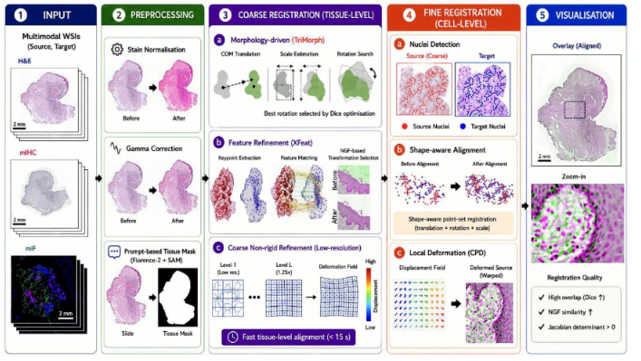

CORE Documentation
==================

**CORE** – A Cell-Level Coarse-to-Fine Image Registration Engine for Multi-stain Image Alignment.

CORE is a fast and accurate coarse-to-fine image registration engine designed for aligning
multi-stain whole-slide images (WSIs).  It combines prompt-based tissue masking, rapid coarse
alignment, and nuclei-level fine registration to deliver precise cell-level correspondence across
stains.

   **Figure 1.** End-to-end CORE pipeline: from raw WSI input through preprocessing, tissue
   masking, coarse rigid/elastic registration, fine nuclei-level registration, to TRE evaluation.

.. toctree::
   :maxdepth: 2
   :caption: Contents

   installation
   quickstart
   configuration
   api/index
   contributing

Indices and tables
------------------

* :ref:`genindex`
* :ref:`modindex`
* :ref:`search`
